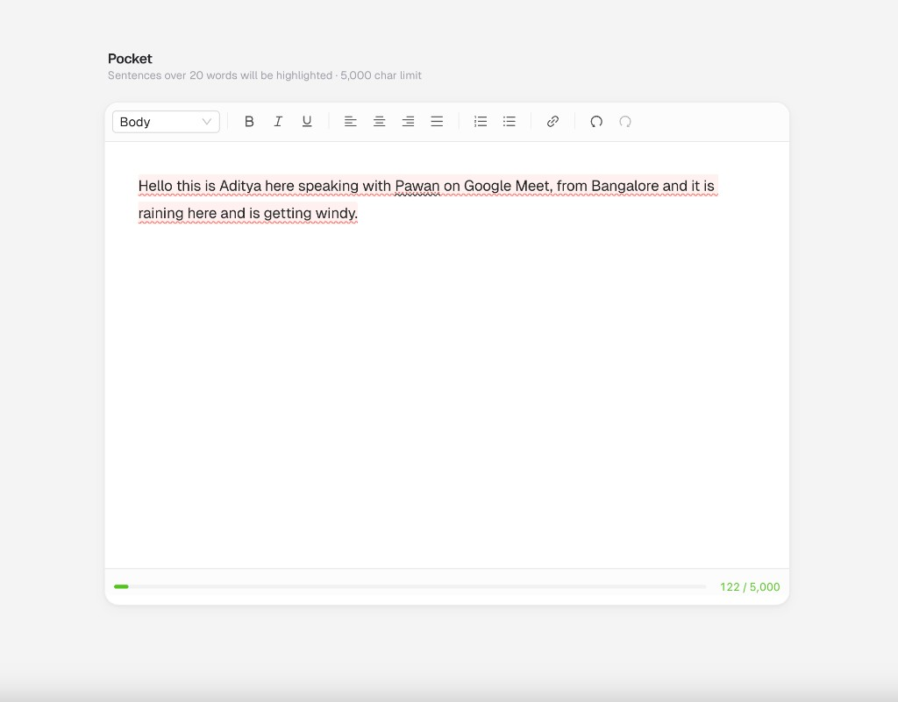

# Pocket — Story Editor

A polished web app that lets users write stories inside a rich-text editor with real-time sentence analysis. Built with Next.js 16, Tiptap v3, Ant Design v6, and Tailwind CSS v4.



## Features

- Rich text editor with 5,000 character limit
- Real-time highlighting of sentences exceeding 20 words
- Formatting toolbar: bold, italic, underline, headings, text alignment, lists, links, undo/redo
- Floating bubble menu on text selection
- Character count progress bar with color ramp (green → amber → red)
- Polished, consumer-grade UI

## Getting Started

```bash
cd aditya-pocket
npm install
npm run dev
```

Open [http://localhost:3000](http://localhost:3000) in your browser.

## Tech Stack

- **Framework**: Next.js 16 (App Router, Turbopack)
- **Editor**: Tiptap v3 (`@tiptap/react`, `@tiptap/starter-kit`, extensions for underline, text-align, link, placeholder)
- **UI**: Ant Design v6 components + Tailwind CSS v4
- **Language**: TypeScript 5

## Project Structure

```
app/
├── components/
│   ├── StoryEditor.tsx      # Main editor wrapper (client component)
│   ├── EditorToolbar.tsx     # Formatting toolbar with antd buttons
│   ├── BubbleToolbar.tsx     # Floating menu on text selection
│   └── CharacterCount.tsx    # Progress bar + count display
├── extensions/
│   └── SentenceHighlight.ts  # Custom tiptap extension (ProseMirror plugin)
├── types/
│   └── index.ts              # Shared types and constants
├── utils/
│   └── helpers.ts            # Sentence extraction, word counting, color ramp
├── layout.tsx                # Root layout with AntdRegistry
├── page.tsx                  # Home page
└── globals.css               # Editor styles + sentence highlight CSS
```

---

## Prompt History

The messages below are the exact prompts used to build this app from scratch, in order.

### Prompt 1 — Initial requirements

> Writer experience:
> 1. Rich text editor with 5000 char limit and 20-word limit per sentence.
> 2. Warn users about sentences exceeding 20-word in real time
> 3. Ui needs to look polished, at par with consumer-facing apps
>
> product requirements:
> The goal is to create a polished-looking web app that allows users to write a story inside the rich-text editor, limiting them upto 5000 characters per story. While the user is typing, we need to check for sentences that exceed 20 words, and prompt them about those sentences - either with text highlight, or in a Drawer/Panel that appears at the right side of the screen.
>
> Engineering requirements:
> 1. Use the tiptap editor to create the rich-text editor component - already installed in the codebase @package.json
> 2. Use antd components for all UI atoms and elements with tailwind as far as possible, and only rely on vanilla html elements and inline css when absolutely necessary.
> 3. The text editor needs to manage its own state, and the content does NOT have to be persisted across browser tabs and page refreshes.
> 4. Keep the React app's logic simple - let each component be abstracted and manage its own state.

### Prompt 2 — Code structure and UI polish

> We should always be defining utility and helper JavaScript/TypeScript functions in a separate helper file.
>
> All extensible and reusable types need to be defined in a separate types file and imported into the components using them.
>
> This helps keep the code DRY and increases maintainability by defining one source of truth for the reusable types.
>
> Also, the UI needs to look exactly like the screenshot provided.
